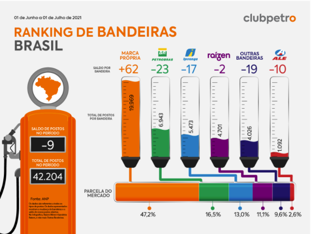
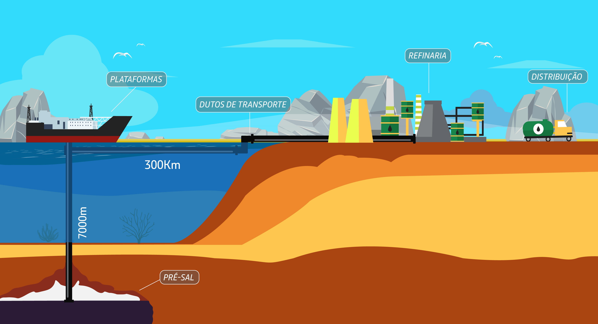

# Qual é a Agência

[A Agência Nacional de Petróleo, Gás e Biocombustíveis](https://www.gov.br/anp/pt-br)

**Objetivo**
- Regulamentar as atividades que integram as indústrias de petróleo e gás natural e de biocombustíveis no Brasil.

O que isso quer dizer: Se perceberem que houve alguma alteração demasiada grande durante a formação de preços, é a ANP que consegue punir a empresa, regulamentar valores, entre outras atuações. Além disso, vale ressaltar que a ANP é filiada ao Ministério das Minas e Energia e foi criada em 1997 pela Lei n 9.478.

## Banco de Dados
A ANP é um centro de referência em dados e informações sobre a indústria do petróleo e gás natural, mantendo o Banco de Dados **(BDEP)** e promovendo diversos estudos e pesquisas.

## Áreas de atuação
- Exploração e produção de petróleo e gás natural
- Refino, processamento, transporte e armazenamento de petróleo, gás natural e derivados
- Distribuição e comércio
- Monitoramento da qualidade dos combustíveis
- Fiscalização
    - do abastecimento nacional de combustíveis
    - da segurança operacional
- Pesquisa de preços
- Biocombustíveis

## Royalties
- Além dos impostos, as empresas que produzem petróleo e gás natural pagam royalties a municípios, a estados e à União

## Impostos que afetam preço dos combustiveis
[Referencia](http://minaspetro.com.br/blog/2021/06/02/quais-impostos-influenciam-no-preco-da-gasolina-descubra/)
- ICMS (estadual)
- Impostos Federais

**Fatores que afetam preço da gasolina**

- Preço do etanol
  - Geralmente, o valor do etanol corresponde a 11% do preço da gasolina revendida 
  

### O que são postos com bandeira branca?
Postos com bandeira branca são aqueles que não possuem vínculo comercial com nenhuma grande marca do mercado.

### Principais empresas de extração
[Referencia](https://www.cnnbrasil.com.br/business/estrangeiras-ja-possuem-20-da-producao-de-oleo-e-gas-no-brasil/)
- Petrobras (73%)
- Shell (12%)
### Principais empresas de refinamento de gasolina
[Referencia](https://www.cnnbrasil.com.br/business/por-que-a-petrobras-quase-nao-tem-concorrentes-na-producao-de-combustivel/)
- Petrobras (98%)
### Principais empresas de distribuição
[Referencia](https://blog.clubpetro.com/ranking-de-bandeiras-no-brasil-em-junho-de-2021/)
- Petrobras
  - Valor de Mercado
  - Principais Regiões 
- Ipiranga
  - Valor de Mercado
  - Principais Regiões 
- Raízen
  - Valor de Mercado
  - Principais Regiões

### Pontos a ressaltar dessa breve introdução
- O ICMS influencia diretamente no valor da gasolina por estados.
- O preço do etanol influencia no valor da gasolina

**Principais refinarias (barris/dia)**
[Referencia](https://www.suapesquisa.com/geografia/petroleo/refinarias_brasil.htm)
1. Replan (SP) - 435 mil
2. RLAM (BA) - 325 mil
3. Revap (SP) - 252 mil
4. Reduc (RJ) - 239 mil
5. Refinaria Abre e Lima (PE) - 235 mil
6. Refap (RS) - 200 mil
7. Refinaria Presidente Bernardes (SP) - 180 mil 
8. Comperj (RJ) - 170 mil
9. Refinaria Gabriel Passos (MG)- 155 mil
10. Recap (SP) - 53 mil

**Principais regiões produtoras etanol**
